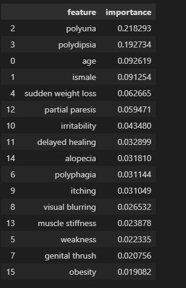

# Early_Diabetes_Prediction
Guided Project to clear the basics of ML
Different classifer algorithms are used and the best one was found out to RandomForest since it gave lowest false negatives
lowest false positives.

